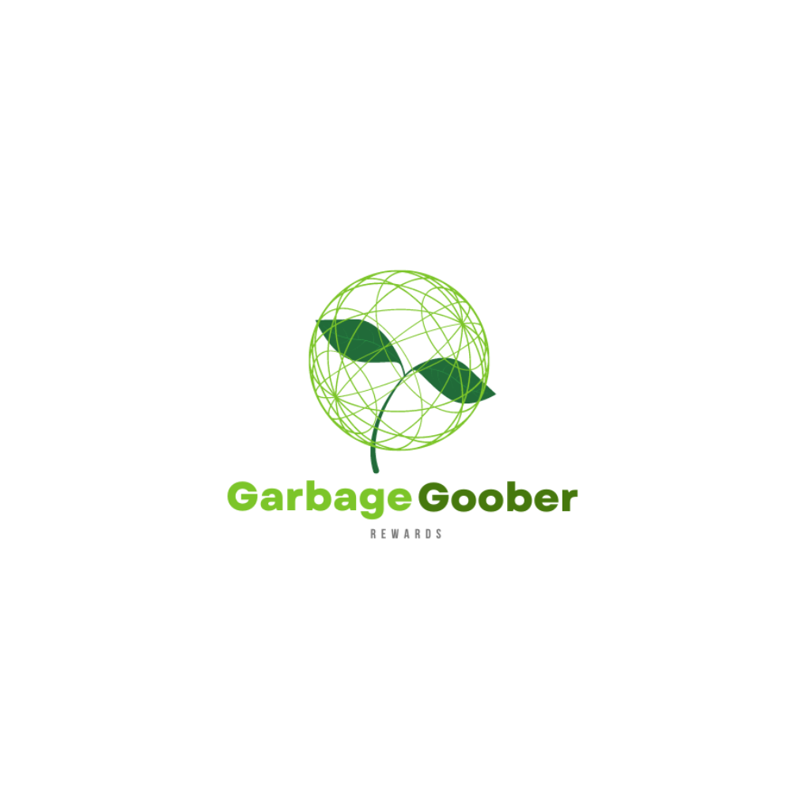

## Getting started

2.  `sudo pip3 install -r requirements.txt`
3.  in Command line: `export FLASK_APP=waste_app.py`
4.  Try: `printenv FLASK_APP`
5.  Output: `waste_app.py`
6. `flask run`

  <h1 align="center">Garbage Goober Rewards</h1>

  

    Decentralised reward distribution for Waste Management using Blockchain & AI.
     
    <a href="https://github.com/MohinishTeja/dragon_hacks"><strong>Explore the docs »</strong></a>
     
     
    <a href="https://youtu.be/kkXdOf3BB2s">Video Demo</a>
    ·
    <a href="https://mohinishteja.github.io/garbage_goober/">View DApp</a>  
    ·
    <a href="https://expo.dev/@jongan69/garbagegooberrewards">Mobile App</a>
  
  
  

# Table of Contents
* [Team Members](#team-members)
* [Inspiration](#a)
* [What it does](#b)
* [How we built it](#c)
* [Challenges](#d)
* [Accomplishments](#e)
# Team Members
* P.Mohinish Teja - <marvelmohinish99@gmail.com>
* Jonathan Gan - <Jonathangan@usf.edu>

# Inspiration
&nbsp; &nbsp; &nbsp; &nbsp;Landfills are one of the largest producers of Methane and 
house gases. Even power generation from Waste produces CO2. Why is it a big problem? It is because of no proper way in dumping. All kind of wastes are dumped which leads to half degrading and pollution of local resources.Dumping of huge amount of waste also causes soil contamination,Water contamination,Air contamination and causes harm for marine and animal life. 

People get incentives for doing the right thing! These later can be regular habits and greatly saves atmosphere thus promoting sustainability. Rewards distributed are through Cryptocurrency from a decentralized application. Garbage thus collected categorically can be **Reused, Recycled** which can fund back the reward distribution process thus making this a circular economy without any burden on reward paying organization.

This will be a great and efficient **Learning experience for Users** as they can see the **amount of Carbon they offset** by disposing waste categorically thus habituating them psychologically to understand and follow green practices in every possible way in their day to day life.

  

  
#  What it does
&nbsp; &nbsp; &nbsp; &nbsp;**Garbage Goober Rewards** rewards people after dumping waste categorically. Payment is governed by Smart Contract which ensures guaranteed, safe and quick reward payment to users. Deep Learning model integrated determines type of waste automatically. Huge dataset of over 2,200 images stored in IPFS is used to train and test the model. The entire application is deployed through IPFS which ensures safe, quick and lower downtime of application.
  - AI/ML      - To determine the type of waste
  - Blockchain - To distribute rewards

These cover almost all areas of the world without any technological or logistical barriers like access to no computers. **Mobile App** is thus built to cater people who don't have access to better hardware.

We have started out with a flask app for classifying types of waste. Later we decided to implement a better front end experience and Web3 functionality that would allow user to get paid using Web3. We have used Polygon network which is L2 network based on Ethereum. This blockchain is so energy neutral that most of it is powered through alternate energy resources. Single transaction uses only 1/20th of power used by a LED bulb per minute thus not putting any more burden/polluting the environment.

**Mobile App** is also built which has the ability to capture waste images and identify just like the webapp but with additional feature of **Minting NFT**. Further implementation requires users to first have NFT's to participate in Garbage Goober which can be bought from marketplace similar to the model of Stepn. NFT's are minted based on input and can be sold in marketplace. **NFT.storage** is currently used to store the NFT's minted.

Latest technologies like Deep Learning for Waste classification, Blockchain for Reward payout and mobile,web applications ensure the application rewards to only correct waste disposals.
  

&nbsp; &nbsp; &nbsp; &nbsp;As you can see from the images above, Mobile app has classified my laptop as Computer and minted NFT using NFT.storage. <a href="https://bafybeieejjzt6f7qtl7l6ac55qpwptaczufo5m6wm6xhhc7j2gvzpfhotq.ipfs.nftstorage.link">Click here</a> to view that file.
#  How we built it
&nbsp; &nbsp; &nbsp; &nbsp;We have built this DApp as Web App. Entire frontend is built using HTML,CSS,JS. Smart contracts are written using Solidity and deployed on Polygon network. Polygon network helps us in Reduced gas fee and faster transactions. Frontend and Smart contracts are connected using Web3.JS. Convoultional Neural Network is used for determining type of waste instantly with just a picture. It has accuracy of 83% at present with dataset of 2,200+ images in IPFS. This entire DApp is published through IPFS using Fleek platform. IPFS helps us in maintaining large sets of Data with added benefit of no redundancy.
  - React Native - Mobile App framework
  - NFT.storage  - To store the minted NFT's
  - Flask        - To integrate CNN model to Frontend
  - Web3.js      - To connect Smart Contracts with Frontend
  
  
  &nbsp; &nbsp; &nbsp; &nbsp;Mobile Application is built using React native framework and deployed on Expo. Mobile app has the capability to mint NFT's using NFT.storage. **Tokenomics** include sale of these NFT's and access to application only for users with NFT initially to support the reward distribution program.

#  Challenges we ran into
&nbsp; &nbsp; &nbsp; &nbsp;Initially we thought of deploying this application using Rinkeby test network of Ethereum and it lead to higher gas fee and slower transactions. Then we switched to L2 based solution like Polygon. Though it was easy to switch we encountered difficulties in integrating it with Frontend. After further reading Web3.JS  and Polygon docs we found the solution. Further we realized that as this DApp grows we'll be having lot of data to handle. IPFS came to our rescue. We've used Fleek platform to publish DApp on IPFS. Image classification and other predicting models need Multimedia data to predict what kind of waste and how much of it is deposited. IPFS helped us handle these situations. NFT's minted are stored using NFT.storage.

#  Accomplishments that we're proud of
- Multi-chain contract
- MVP Mobile App
- Web App deployed in a fast and low fee blockchain network.
- Utilised NFT.storage for NFT storage.
## What we learned
- To work cohesively even though we're both remote.
- Manage work load equally even though both of us had different skill sets.
- Lot of knowledge on CO2 emissions and rates at which it is increasing and sources of it.
## What's next for Garbage Goober Reward
&nbsp; &nbsp; &nbsp; &nbsp;Right now user manually enters weight of waste. Type of waste is classified by uploading a picture of the waste. This is not the right way for production level implementation. Users will take advantage of this easily. We are thinking of using OpenCV to detect and determine type of waste in real time without any human intervention. This cannot be done due to time constraints for the hackathon. As these features will be integrated data plays important role and we will be using OpenCV & IPFS efficiently in upcoming versions.

&nbsp; &nbsp; &nbsp; &nbsp;NFT marketplace will be setup and we'll implement features like access to application only if having NFT, limited NFT items release etc., for generating revenue to distribute rewards. Overall this shall become a circular economy where NFT's can be used for trading and recognition and also helps fund reward distribution programme which brings lot of potential for utility to our NFT and project.
  
## Gallery

